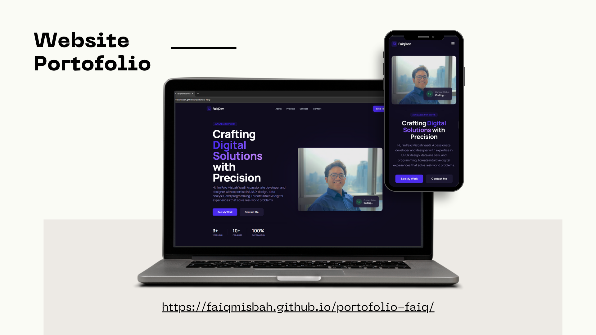

<div align="center">

# 🌟 Faiq Misbah Yazdi — Personal Portfolio

[](https://faiqmisbah.github.io/portofolio-faiq/)
[](https://react.dev/)
[](https://www.typescriptlang.org/)
[](https://vitejs.dev/)

<p align="center">
  A modern, high-performance portfolio website built with <b>React 19</b>, <b>TypeScript</b>, and <b>Vite</b>, featuring interactive project showcases, glassmorphism aesthetics, and direct contact integration.
</p>

[🌐 **View Live Website**](https://faiqmisbah.github.io/portofolio-faiq/) · [📑 **Developer Guide (Panduan)**](panduan.md)

</div>

---

## 📌 Preview

<div align="center">
  
</div>

---

## ✨ Key Features

- 🎨 **Modern Glassmorphism UI**: Sleek dark mode design paired with vibrant cyan highlights and micro-interactions.
- 📂 **Interactive Project Showcase**: Filterable portfolio items featuring real-world projects in Web Development and UI/UX Design.
- 🔍 **Detailed Project Modals**: Deep-dive into project problem statements, solutions, and technology stacks.
- ⚡ **Lightning Fast Performance**: Built using Vite 6 & React 19 for instantaneous page loads and smooth transitions.
- ✉️ **Integrated Contact Form**: Direct client inquiry delivery powered by EmailJS API.
- 📱 **Fully Responsive**: Seamlessly optimized for smartphones, tablets, and desktop displays.

---

## 🛠️ Tech Stack & Tools

| Category | Technologies Used |
|---|---|
| **Frontend Framework** | React 19, TypeScript |
| **Build & Bundler** | Vite 6 |
| **Styling & Design** | Custom CSS3, Glassmorphism, TailwindCSS utilities |
| **Icons & Assets** | React Icons, Google Material Symbols |
| **Services & Deployment**| EmailJS, GitHub Pages |

---

## 🚀 Featured Projects

| Project | Category | Live Demo / Link |
|---|---|---|
| **FaiqDev Portfolio** | Web Dev | [Live Site](https://faiqmisbah.github.io/portofolio-faiq/) |
| **Quote Generator** | Web Dev | [Live Demo](https://faiqmisbah.github.io/quote-generator/) |
| **Sakuin Fintech Landing Page** | Web Dev | [Live Demo](https://sakuin-zeta.vercel.app/) |
| **JAKI Design System** | UI/UX Design | Jakarta Smart City Ecosystem |
| **E-Voting Platform Concept** | Web Dev / UI/UX | Digital Election Landing Page |
| **FoodGo Web Platform** | Web Dev | Food Delivery App Interface |

---

## 💻 Quick Start & Installation

To run this portfolio locally on your machine:

```bash
# 1. Clone the repository
git clone https://github.com/faiqmisbah/portofolio-faiq.git

# 2. Navigate to the project directory
cd portofolio-faiq

# 3. Install dependencies
npm install

# 4. Start local development server
npm run dev
```

Open `http://localhost:3000` in your browser to view the application.

> 📖 **Need technical maintenance guidance?** Check out the full [Developer Guide (panduan.md)](panduan.md) for photo management, EmailJS setup, and folder structure details.

---

## 🤝 Connect With Me

<div align="center">

[](https://www.linkedin.com/in/faiq-misbah/)
[](https://github.com/faiqmisbah)
[](https://www.instagram.com/faiqmisbah_/)
[](https://www.youtube.com/@faiqmisbahy)
[](mailto:faiqmisbah019@gmail.com)

</div>

---

<div align="center">
  <sub>Designed & Developed by <b>Faiq Misbah Yazdi</b> © 2026. All rights reserved.</sub>
</div>
